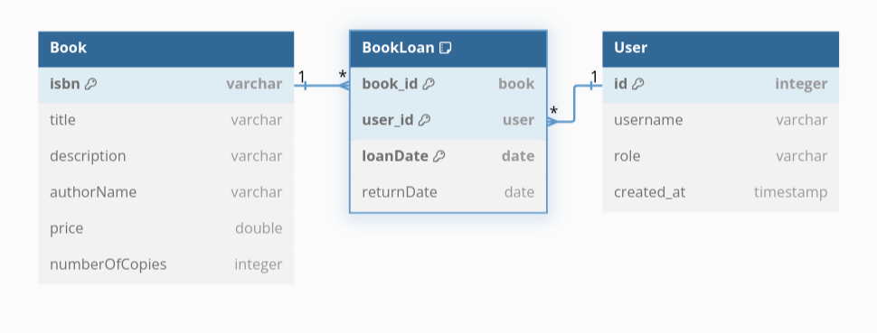

# Application Bibliothèque

Cette application a été réalisée dans le cadre d'une évaluation Java. 

## Versions
Cette application a été développée sous le JDK Temurin 21.

## Architecture
L'architecture de l'application s'inspire de la *Clean Architecture*. On trouve les dossiers suivants : 
* data : contient les repository et les connexions à la "base de données" (fichier json)
* exceptions : contient les exceptions custom. 
* models : contient les entités. 
* services : contient les services. Permet l'interface entre la couche d'accès au données (data) et la couche présentation (main). Contient le code métier.

## Données
Les relations entre les classes sont les suivantes : 

Les données de l'application sont disponibles dans le fichier resources/catalogue_livres.json.

## Explication des choix techniques 
* Les repository sont des passe-plats avec la base de données JSON. Ce sont des singletons parce qu'on veut pouvoir utiliser le même repo quel que soit l'endroit d'où le repository est appelé. Ils sont rédigés avec les principes de clean architecture en tête : ce sont aujourd'hui des passe-plats, mais si l'on remplace le fichier json par une base de données, le remplacement de ces repo par d'autres repository pourrait se faire sans modification aux services, ou minimes.
* Idéalement, on utiliserait une base de données, le JSON forçant soit la réécriture complète à chaque interaction (coûteux), soit la volatilité des données (le risque est de perdre des données si l'application s'arrête de façon inattendue). Le JSON est le format forcé par le sujet du cours ; cette application n'ayant pas vocation à être utilisée dans le futur, on choisit d'endurer le risque de perte de données.
* On utilise FastJson pour le json, car c'est une librairie rapide et simple à prendre en mai
* Les classes contenues dans models ne sont pas testées, car tester leur code reviendrait à tester lombok. 
* La classe main n'est pas testée.

## Faiblesses de l'application :
* Il est possible d'obtenir deux utilisateurs avec le même login